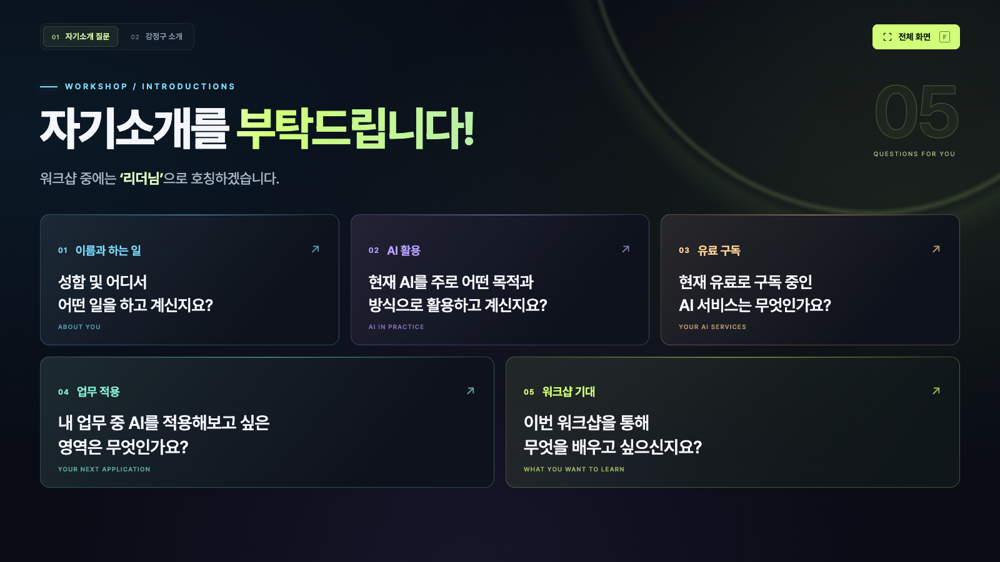
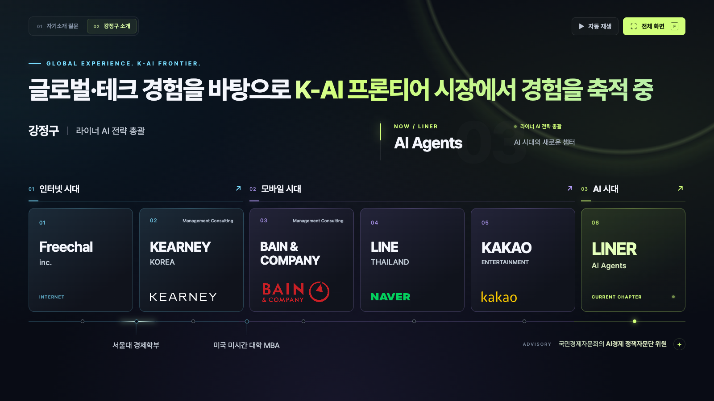

# AI 워크샵 · 자기소개

16:9 비율의 인터랙티브 HTML 슬라이드입니다. 글꼴과 로고가 HTML에 포함되어 있어 인터넷 연결 없이 열 수 있습니다.

## 슬라이드

1. **자기소개 질문** — 이름과 하는 일, AI 활용, 유료 구독, 업무 적용, 워크샵 기대에 관한 다섯 가지 질문. 질문 카드를 누르면 크게 볼 수 있습니다.
2. **강정구 소개** — 경력 타임라인, 학력, 자문 활동. 회사와 시대를 선택해 살펴볼 수 있습니다.

## 사용 방법

`index.html`을 다운로드한 뒤 웹 브라우저에서 엽니다. 별도 설치나 빌드가 필요하지 않습니다.

- 상단 탭 또는 `Page Up` / `Page Down`으로 페이지를 이동합니다.
- **전체 화면** 버튼 또는 `F` 키로 전체 화면을 전환합니다.
- 경력 소개 페이지의 **자동 재생** 버튼으로 타임라인을 재생합니다.
- 질문 확대 화면에서는 좌우 화살표로 질문을 바꾸고 `Esc`로 닫습니다.

## 미리보기

### 자기소개 질문

### 강정구 소개

