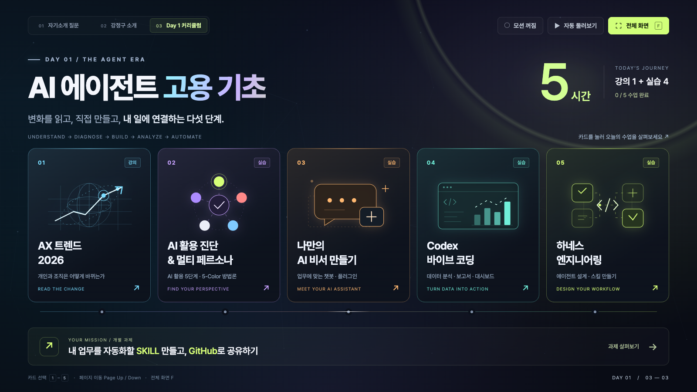
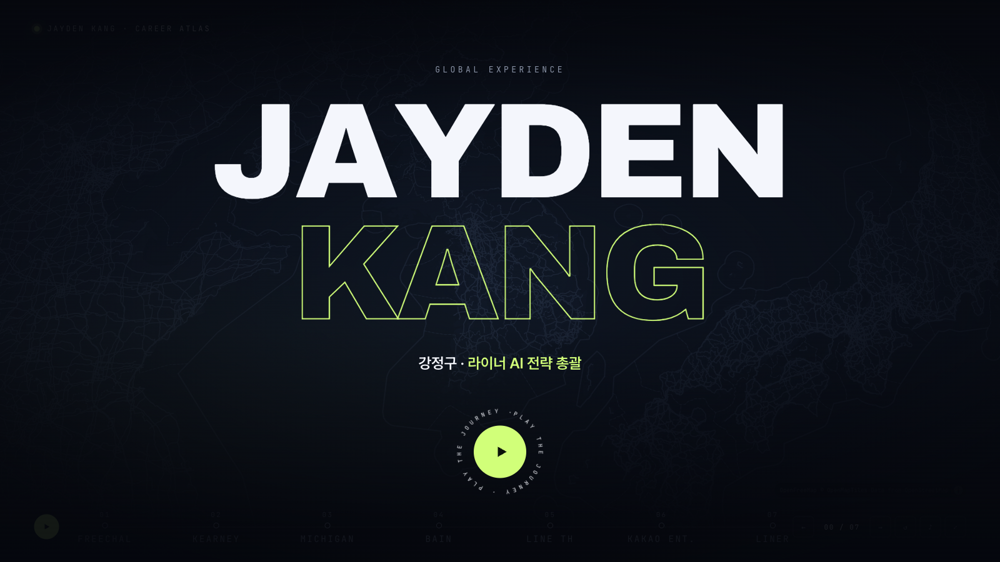
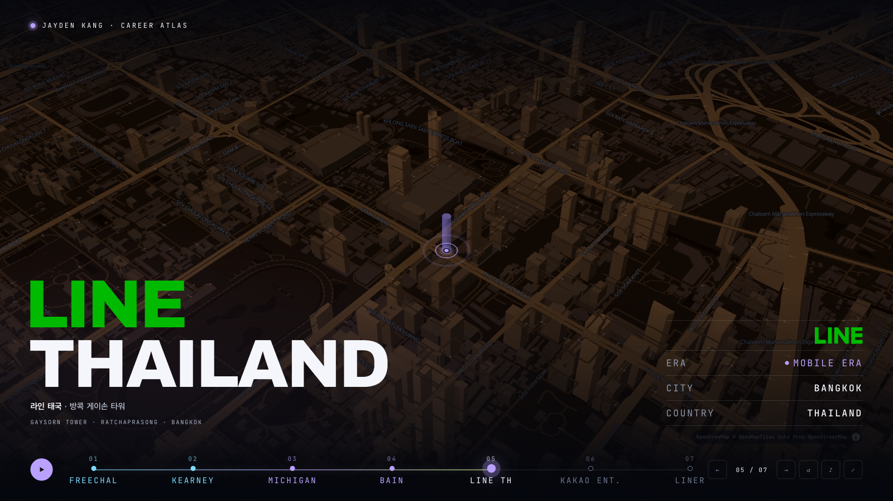

# AI 워크샵 · 자기소개

16:9 비율의 인터랙티브 HTML 슬라이드입니다. 글꼴과 로고가 HTML에 포함되어 있어 인터넷 연결 없이 열 수 있습니다.

## Day 1 수업이 추가된 복사본

`posco_202609.html`은 기존 2페이지를 복사하고 **3페이지: Day 1 커리큘럼 / AI 에이전트 고용 기초**를 추가한 파일입니다. `intro.html`은 원본 그대로입니다.

- 5개 수업 카드를 클릭하거나 숫자 `1`–`5`를 눌러 상세 내용을 엽니다.
- 상세 화면에서 좌우 화살표로 이동하고, `Esc`로 닫습니다.
- **자동 둘러보기**는 각 수업과 개별 과제를 9초 간격으로 보여줍니다.
- **수업 완료 표시**로 진행 상황을 확인하고 다시 눌러 취소할 수 있습니다. 완료 표시는 새로고침하면 초기화됩니다.
- **모션 켜짐/꺼짐**, 전체 화면, 기존 페이지의 인터랙션을 지원합니다.
- 파일 주소 뒤에 `#day1`을 붙이면 3페이지가 바로 열립니다.

## 국가 AI 대상 페이지가 추가된 복사본

`igm.html`은 `posco_202609.html`을 복사하고 2페이지 뒤에 **3페이지: 국가 AI 대상**을 넣은 파일입니다. Day 1 커리큘럼은 4페이지로 밀렸습니다. `posco_202609.html`은 그대로입니다.

- AI WEEK 26 국가 AI 대상 포스터를 왼쪽에, 라이너 수상 내용(서울특별시장상, AI 리서치 에이전트 플랫폼)을 오른쪽에 보여줍니다.
- 포스터를 클릭하거나 `Z`(또는 `Enter`)를 누르면 라이너 행이 화면 가득 확대되고, 나머지 영역은 어두워집니다. 다시 누르거나 `Esc`로 돌아옵니다.
- 파일 주소 뒤에 `#award`를 붙이면 3페이지가, `#day1`을 붙이면 4페이지가 바로 열립니다.
- 포스터 이미지는 HTML에 base64로 들어 있어 파일 하나로 동작합니다.

## Career Atlas (지도 위 경력 여정)

`index.html`(사이트 첫 화면)은 경력 7개 지점을 3D 지도 위에서 차례로 날아가며 보여주는 단독 페이지입니다. 경영 리더 대상 AI 워크샵 첫머리에 강사 소개로 프로젝터에 띄우는 용도입니다. 슬라이드 덱과 별개 파일입니다.

- 순서: 프리챌(선릉), 커니(아셈타워), 미시간 MBA, 베인(스테이트 타워 남산), 라인 태국, 카카오엔터테인먼트(판교), 라이너(홍대).
- 시작 화면은 한반도가 보이는 높이에서 천천히 돌고, 재생을 누르면 첫 지점으로 줌인합니다. 자동 재생은 약 80초입니다.
- 지점마다 4초(2마디) 머물고, 결론인 라이너는 8초(4마디) 머물며 헤드라인이 천천히 커집니다. 같은 도시 안 이동(프리챌 → 커니)과 첫 비행은 이동 표시 없이 바로 날아갑니다.
- 시대 전환 화면: INTERNET ERA(세 줄이 위아래 반대로 흐름), MOBILE ERA(스마트폰 윤곽 → 앱 아이콘 → 화면 안으로 줌인), AI ERA(매트릭스식 문자 비 속에서 ARTIFICIAL / INTELLIGENCE가 한 글자씩 고정). COVID-19 OUTBREAK는 방콕에서 판교로 오기 전 사건 카드입니다.
- 카카오엔터테인먼트에서는 출장 화면(PANGYO → LOS ANGELES, NEW YORK, BEIJING, BANGKOK, TAIPEI, JAKARTA)이 나오고, 끝나면 지도를 거치지 않고 바로 AI ERA로 넘어갑니다.
- 회사명 첫 줄은 회사 색을 따릅니다(LINE 초록, KAKAO 노랑, 미시간은 둘째 줄 MICHIGAN에 강조색). 회사명은 첫 글자 잉크 기준으로 아래 줄과 왼쪽 정렬됩니다.
- 지도 색은 나라별로 다릅니다(한국 남색, 미국 청록, 태국 호박색). 지도 글자는 도착한 뒤에만 흐리게 나오고(한국은 한국어, 해외는 영어), 지도 위로 흐르는 큰 투명 글자는 쓰지 않습니다.
- 요약 화면: 3 ERAS / 9 CITIES / 6 COUNTRIES, GLOBAL EXPERIENCE. K-AI FRONTIER. 지구가 돌며 지나온 도시와 출장 도시를 점으로 보여줍니다(선 없음).
- **음악:** 재생 버튼을 누르면 120 BPM 오리지널 비트가 함께 시작합니다(Web Audio로 직접 연주, 외부 음원·저작권 없음). 시대가 바뀔수록 층이 쌓입니다(INTERNET 기본 그루브 → MOBILE 밝은 플럭 아르페지오 → AI 16분 신스 아르페지오·펌핑 베이스·글리치). 전환 직전 스네어 롤과 상승음, 전환 첫 박에 임팩트와 크래시가 들어가고, 장면은 박에, 전환 화면은 마디 첫 박에 맞춰 시작합니다. 일시 정지하면 음악도 멈추고 `M` 키나 ♪ 버튼으로 소리를 끕니다.
- `Space` 재생/일시 정지, `←` `→` 지점 이동, 숫자 `1`–`7`로 해당 지점 바로 가기, `R` 처음부터, `F` 전체 화면, `M` 소리 끄기/켜기.
- **인터넷 연결이 필요합니다.** 지도 타일(OpenFreeMap), 지도 엔진(MapLibre), 애니메이션(GSAP), 글꼴을 외부에서 불러옵니다. 지도를 못 불러오면 격자 배경으로 끝까지 진행하고 요약 화면도 나옵니다.

### 품질 기준과 평가 기록

5-Color Harness 비평가 4명(RED 논리, SILVER 연출, BLUE 감정, GOLD 50대 임원 청중)으로 7차례 채점했습니다. 종합 평균은 1차 6.4에서 7차 8.8로 올랐고, RED는 9.5로 합격 판정했습니다. 이후 소유자 피드백(시대별 전환 연출, 음악 편곡, 문구 정리)을 반영했습니다. 장면 캡처와 채점 브리프는 `.build/eval/`에 있습니다(Git 제외).

### 고칠 때

- 지점 데이터는 `const STOPS` 배열에 있습니다. `dwell`(체류), `fly`(비행 시간), `opens`(이 지점 앞에서 새 시대 전환), `before`(사건 카드), `trips`(출장 화면: 도시·국가·좌표), `climax`(결론 연출), `headColor`·`accentLine`(헤드라인 색) 필드로 조정합니다.
- 시간은 `DWELL`, `FLY` 상수이고 주석에 예산 계산식이 있습니다. 박(500ms)의 배수를 유지해야 장면이 박에 떨어집니다. 30초·90초는 정신없었고, 대양 횡단을 4.5초로 줄이면 지도 타일이 덜 그려졌습니다.
- 음악은 `const Music`(템포 `BPM`, 코드 `CH`·`ROOT`, 패턴 `play()`, 효과음 `sfx()`), 시대 전환 화면은 `eraSweep()`·`mobileSweep()`·`aiSweep()`, 나라별 지도 색은 `THEMES`에 있습니다.
- 흐르는 줄 안쪽 요소의 클래스는 `mtrack`입니다. `track`은 하단 레일 선 이름이라, 겹치면 전환 화면 글자가 1px로 눌립니다.
- 검증 스크립트(`.build/`, Git 제외): `beat-run.mjs`(박자 정렬과 전체 타임라인), `check-gap.mjs`(출장 → AI 사이 지도 노출 프레임), `check-all-stops.mjs`(지점별 문구와 오류), `nomap-run.mjs`(지도 엔진 없이 재생).

## 슬라이드

1. **자기소개 질문**: 이름과 하는 일, AI 활용, 유료 구독, 업무 적용, 워크샵 기대에 관한 다섯 가지 질문. 질문 카드를 누르면 크게 볼 수 있습니다.
2. **강정구 소개**: 경력 타임라인, 학력, 자문 활동. 회사와 시대를 선택해 살펴볼 수 있습니다.

## 사용 방법

`intro.html`을 다운로드한 뒤 웹 브라우저에서 엽니다. 별도 설치나 빌드가 필요하지 않습니다.

- 상단 탭 또는 `Page Up` / `Page Down`으로 페이지를 이동합니다.
- **전체 화면** 버튼 또는 `F` 키로 전체 화면을 전환합니다.
- 경력 소개 페이지의 **자동 재생** 버튼으로 타임라인을 재생합니다.
- 질문 확대 화면에서는 좌우 화살표로 질문을 바꾸고 `Esc`로 닫습니다.

## 미리보기

### 자기소개 질문

### 강정구 소개

